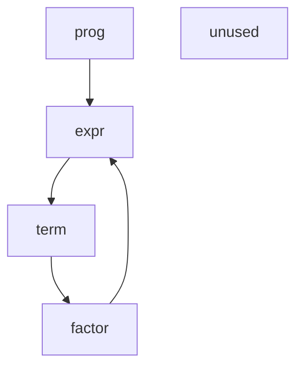

# ANTLR4 MCP Server — User Guide

**Version 0.2.0** | **9 Tools** | **240 Tests**

This guide covers all tools, parameters, and usage patterns for the ANTLR4 MCP Server.

---

## Table of Contents

1. [validate_grammar](#1-validate_grammar)
2. [parse_sample](#2-parse_sample)
3. [detect_ambiguity](#3-detect_ambiguity)
4. [analyze_left_recursion](#4-analyze_left_recursion)
5. [analyze_first_follow](#5-analyze_first_follow)
6. [analyze_call_graph](#6-analyze_call_graph)
7. [visualize_atn](#7-visualize_atn)
8. [compile_grammar_multi_target](#8-compile_grammar_multi_target)
9. [profile_grammar](#9-profile_grammar)

---

## 1. `validate_grammar`

Validates ANTLR4 grammar syntax and reports errors with actionable suggestions.

### Parameters

| Name | Type | Required | Description |
|------|------|----------|-------------|
| `grammar_text` | string | Yes | Complete ANTLR4 grammar |
| `grammar_name` | string | No | Expected name (for validation) |

### Example

**Prompt:**
```
Validate this grammar:

grammar Hello;
greeting: 'hello' name ;
name: WORD ;
WORD: [a-zA-Z]+ ;
WS: [ \t\r\n]+ -> skip ;
```

<details>
<summary><b>Response</b></summary>

```json
{
  "success": true,
  "grammarName": "Hello",
  "grammarType": "COMBINED",
  "ruleCount": 2,
  "tokenCount": 2,
  "errors": [],
  "warnings": []
}
```

</details>

### Error Example

**Prompt:**
```
Validate this grammar:

grammar Broken;
start: undefined_rule ;
```

<details>
<summary><b>Response</b></summary>

```json
{
  "success": false,
  "grammarName": "Broken",
  "errors": [
    {
      "type": "UNDEFINED_RULE",
      "line": 2,
      "column": 7,
      "message": "reference to undefined rule: undefined_rule",
      "severity": "ERROR",
      "suggestedFix": "Define the rule or check for typos"
    }
  ]
}
```

</details>

---

## 2. `parse_sample`

Parses input text using the grammar and returns the parse tree. Uses fast interpreter mode.

### Parameters

| Name | Type | Required | Description |
|------|------|----------|-------------|
| `grammar_text` | string | Yes | Complete ANTLR4 grammar |
| `sample_input` | string | Yes | Input to parse |
| `start_rule` | string | Yes | Parser rule to start from |
| `show_tokens` | boolean | No | Include token list (default: true) |

### Example

**Prompt:**
```
Parse "hello world" using:

grammar Hello;
greeting: 'hello' name ;
name: WORD ;
WORD: [a-zA-Z]+ ;
WS: [ \t\r\n]+ -> skip ;

Start rule: greeting
```

<details>
<summary><b>Response</b></summary>

```json
{
  "success": true,
  "parseTree": "(greeting hello (name world))",
  "tokens": [
    {"type": "'hello'", "text": "hello", "line": 1, "column": 0},
    {"type": "WORD", "text": "world", "line": 1, "column": 6}
  ],
  "errors": []
}
```

</details>

---

## 3. `detect_ambiguity`

Detects parsing ambiguities by analyzing the grammar structure and testing with sample inputs.

### Parameters

| Name | Type | Required | Description |
|------|------|----------|-------------|
| `grammar_text` | string | Yes | Complete ANTLR4 grammar |
| `sample_inputs` | array | No | Inputs to test for ambiguities |
| `start_rule` | string | No | Start rule for testing |

### Example

**Prompt:**
```
Check for ambiguities:

grammar Ambiguous;
stat: 'if' expr 'then' stat
    | 'if' expr 'then' stat 'else' stat
    | ID '=' expr ';'
    ;
expr: ID | NUMBER ;
ID: [a-z]+ ;
NUMBER: [0-9]+ ;
WS: [ \t\r\n]+ -> skip ;
```

<details>
<summary><b>Response</b></summary>

```json
{
  "success": true,
  "grammarName": "Ambiguous",
  "hasAmbiguities": true,
  "ambiguities": [
    {
      "rule": "stat",
      "description": "Dangling else ambiguity",
      "alternatives": [1, 2],
      "sampleInput": "if x then if y then a = 1; else b = 2;"
    }
  ],
  "suggestions": [
    "Use semantic predicates to resolve",
    "Restructure grammar to make binding explicit"
  ]
}
```

</details>

---

## 4. `analyze_left_recursion`

Detects direct and indirect left recursion patterns in the grammar.

### Parameters

| Name | Type | Required | Description |
|------|------|----------|-------------|
| `grammar_text` | string | Yes | Complete ANTLR4 grammar |

### Example

**Prompt:**
```
Analyze left recursion:

grammar Expr;
expr: expr '+' term | term ;
term: term '*' factor | factor ;
factor: NUMBER | '(' expr ')' ;
NUMBER: [0-9]+ ;
```

<details>
<summary><b>Response</b></summary>

```json
{
  "success": true,
  "grammarName": "Expr",
  "hasLeftRecursion": true,
  "directLeftRecursion": [
    {
      "rule": "expr",
      "pattern": "expr -> expr '+' term",
      "isHandledByAntlr": true
    },
    {
      "rule": "term",
      "pattern": "term -> term '*' factor",
      "isHandledByAntlr": true
    }
  ],
  "indirectLeftRecursion": [],
  "notes": [
    "ANTLR4 automatically transforms direct left recursion"
  ]
}
```

</details>

---

## 5. `analyze_first_follow`

Computes FIRST and FOLLOW sets for grammar rules — essential for understanding parser predictions.

### Parameters

| Name | Type | Required | Description |
|------|------|----------|-------------|
| `grammar_text` | string | Yes | Complete ANTLR4 grammar |
| `rule_name` | string | No | Specific rule (default: all) |

### Example

**Prompt:**
```
Compute FIRST/FOLLOW sets:

grammar Simple;
prog: stmt+ ;
stmt: ID '=' expr ';' ;
expr: term (('+' | '-') term)* ;
term: NUMBER | ID ;
ID: [a-z]+ ;
NUMBER: [0-9]+ ;
WS: [ \t\r\n]+ -> skip ;
```

<details>
<summary><b>Response</b></summary>

```json
{
  "success": true,
  "grammarName": "Simple",
  "rules": [
    {
      "name": "prog",
      "firstSet": ["ID"],
      "followSet": ["<EOF>"]
    },
    {
      "name": "stmt",
      "firstSet": ["ID"],
      "followSet": ["ID", "<EOF>"]
    },
    {
      "name": "expr",
      "firstSet": ["NUMBER", "ID"],
      "followSet": ["';'"]
    },
    {
      "name": "term",
      "firstSet": ["NUMBER", "ID"],
      "followSet": ["'+'", "'-'", "';'"]
    }
  ],
  "conflicts": []
}
```

</details>

---

## 6. `analyze_call_graph`

Analyzes rule dependencies, detects cycles, and identifies unused rules.

### Parameters

| Name | Type | Required | Description |
|------|------|----------|-------------|
| `grammar_text` | string | Yes | Complete ANTLR4 grammar |
| `output_format` | string | No | `json`, `dot`, or `mermaid` |

### Example

**Prompt:**
```
Show rule dependencies in Mermaid format:

grammar Calc;
prog: expr+ ;
expr: term (('+' | '-') term)* ;
term: factor (('*' | '/') factor)* ;
factor: NUMBER | '(' expr ')' ;
unused: 'dead' ;
NUMBER: [0-9]+ ;
```

<details>
<summary><b>Response (Mermaid)</b></summary>



</details>

<details>
<summary><b>Response (JSON)</b></summary>

```json
{
  "success": true,
  "grammarName": "Calc",
  "nodes": [
    {"name": "prog", "type": "PARSER"},
    {"name": "expr", "type": "PARSER"},
    {"name": "term", "type": "PARSER"},
    {"name": "factor", "type": "PARSER"},
    {"name": "unused", "type": "PARSER"}
  ],
  "edges": [
    {"from": "prog", "to": "expr"},
    {"from": "expr", "to": "term"},
    {"from": "term", "to": "factor"},
    {"from": "factor", "to": "expr"}
  ],
  "cycles": [["expr", "term", "factor", "expr"]],
  "unusedRules": ["unused"],
  "warnings": ["Rule 'unused' is never referenced"]
}
```

</details>

---

## 7. `visualize_atn`

Generates ATN (Augmented Transition Network) state machine diagrams.

### Parameters

| Name | Type | Required | Description |
|------|------|----------|-------------|
| `grammar_text` | string | Yes | Complete ANTLR4 grammar |
| `rule_name` | string | No | Specific rule (default: all) |
| `format` | string | No | `dot`, `mermaid`, or `svg` |

### Example

**Prompt:**
```
Generate ATN diagram for expr rule in Mermaid:

grammar Expr;
expr: term (('+' | '-') term)* ;
term: NUMBER ;
NUMBER: [0-9]+ ;
```

<details>
<summary><b>Response</b></summary>

```json
{
  "success": true,
  "grammarName": "Expr",
  "rule": "expr",
  "format": "mermaid",
  "diagram": "stateDiagram-v2\n    [*] --> s0\n    s0 --> s1: term\n    s1 --> s2: '+' | '-'\n    s2 --> s1: term\n    s1 --> [*]",
  "stateCount": 3,
  "transitionCount": 4
}
```

</details>

---

## 8. `compile_grammar_multi_target`

Generates parser/lexer code for multiple target languages.

### Parameters

| Name | Type | Required | Description |
|------|------|----------|-------------|
| `grammar_text` | string | Yes | Complete ANTLR4 grammar |
| `target_language` | string | Yes | `java`, `python`, `javascript`, `typescript`, `cpp`, `csharp`, `go`, `swift`, `php`, `dart` |
| `package_name` | string | No | Package/namespace |
| `generate_visitor` | boolean | No | Generate visitor (default: true) |
| `generate_listener` | boolean | No | Generate listener (default: true) |

### Example

**Prompt:**
```
Generate Python parser:

grammar Hello;
greeting: 'hello' name ;
name: WORD ;
WORD: [a-zA-Z]+ ;
WS: [ \t\r\n]+ -> skip ;
```

<details>
<summary><b>Response</b></summary>

```json
{
  "success": true,
  "grammarName": "Hello",
  "targetLanguage": "python",
  "files": [
    {"filename": "HelloLexer.py", "content": "# Generated..."},
    {"filename": "HelloParser.py", "content": "# Generated..."},
    {"filename": "HelloListener.py", "content": "# Generated..."},
    {"filename": "HelloVisitor.py", "content": "# Generated..."}
  ],
  "instructions": "pip install antlr4-python3-runtime"
}
```

</details>

### Target Runtimes

| Language | Runtime Package |
|----------|----------------|
| Java | `org.antlr:antlr4-runtime:4.13.2` |
| Python | `pip install antlr4-python3-runtime` |
| JavaScript | `npm install antlr4` |
| TypeScript | `npm install antlr4ts` |
| C++ | ANTLR4 C++ runtime |
| C# | `Antlr4.Runtime.Standard` |
| Go | `github.com/antlr4-go/antlr/v4` |
| Swift | ANTLR4 Swift runtime |
| PHP | `antlr/antlr4-php-runtime` |
| Dart | `antlr4` package |

---

## 9. `profile_grammar`

Profiles grammar performance by analyzing decision statistics and lookahead requirements.

### Parameters

| Name | Type | Required | Description |
|------|------|----------|-------------|
| `grammar_text` | string | Yes | Complete ANTLR4 grammar |
| `sample_input` | string | Yes | Input for profiling |
| `start_rule` | string | Yes | Start rule |

### Example

**Prompt:**
```
Profile this grammar with input "1 + 2 * 3":

grammar Expr;
prog: expr+ ;
expr: expr ('*'|'/') expr
    | expr ('+'|'-') expr
    | NUMBER
    ;
NUMBER: [0-9]+ ;
WS: [ \t\r\n]+ -> skip ;

Start rule: prog
```

<details>
<summary><b>Response</b></summary>

```json
{
  "success": true,
  "grammarName": "Expr",
  "totalTimeNanos": 1250000,
  "totalSLLLookahead": 12,
  "totalDFAStates": 8,
  "decisions": [
    {
      "decisionNumber": 0,
      "ruleName": "prog",
      "invocations": 1,
      "sllMaxLook": 2,
      "ambiguityCount": 0
    },
    {
      "decisionNumber": 1,
      "ruleName": "expr",
      "invocations": 3,
      "sllMaxLook": 3,
      "llFallback": 0,
      "ambiguityCount": 1
    }
  ],
  "insights": [
    "Total decisions: 2",
    "Parse time: 1.25ms"
  ],
  "optimizationHints": [
    "Expression has left recursion - ANTLR handles automatically"
  ]
}
```

</details>

---

## Common Workflows

### Grammar Development Cycle

```
1. validate_grammar      → Check syntax
2. parse_sample          → Test with inputs
3. detect_ambiguity      → Find issues
4. analyze_left_recursion → Check recursion
5. analyze_first_follow  → Understand predictions
6. profile_grammar       → Check performance
7. compile_grammar_multi_target → Generate code
```

### Quick Validation

```
Validate and parse "hello world" with:

grammar Hello;
greeting: 'hello' WORD ;
WORD: [a-z]+ ;
WS: [ \t\r\n]+ -> skip ;
```

### Full Analysis

```
Give me a complete analysis:
- Validation
- Left recursion check
- FIRST/FOLLOW sets
- Ambiguity detection
- Call graph

grammar Expr;
expr: expr '+' term | term ;
term: term '*' factor | factor ;
factor: NUMBER | '(' expr ')' ;
NUMBER: [0-9]+ ;
WS: [ \t\r\n]+ -> skip ;
```

---

## Constraints

| Constraint | Value |
|------------|-------|
| Max grammar size | 10 MB |
| Max input size | 1 MB |
| Compilation timeout | 30 seconds |
| Imports | Not supported (inline all rules) |

---

## Troubleshooting

| Issue | Solution |
|-------|----------|
| "Grammar not found" | Ensure `grammar Name;` declaration exists |
| "Start rule not found" | Parser rules are lowercase |
| "Ambiguity detected" | Use `detect_ambiguity` for details |
| Slow performance | Use `profile_grammar` to identify bottlenecks |

---

## Resources

- [ANTLR4 Documentation](https://github.com/antlr/antlr4/blob/master/doc/index.md)
- [Grammar Examples](https://github.com/antlr/grammars-v4)
- [MCP Specification](https://modelcontextprotocol.io/)
